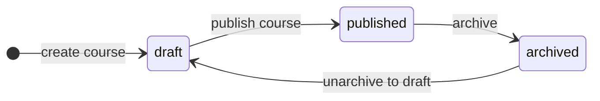

# Модель контента и Course Builder

## Назначение документа

Описывает, как хранится учебный контент в target-архитектуре: **Postgres — source of truth**, файлы — import/export. Включает экраны Course Builder и педагогический контракт урока.

Связанные документы: [DATABASE_MODEL.md](DATABASE_MODEL.md), [NEXT_FULLSTACK_ADAPTATION.md](NEXT_FULLSTACK_ADAPTATION.md), [MVP_ROADMAP.md](MVP_ROADMAP.md).

Previous file-based contract (authoring guidelines): [docs/course_authoring/COURSE_PACK_CONTRACT.md](../course_authoring/COURSE_PACK_CONTRACT.md).

---

## Source of truth

| Данные | Где хранится |
|--------|--------------|
| Структура курса (course, module, lesson order) | Postgres |
| Тело урока (Markdown) | `Lesson.bodyMarkdown` |
| Задачи, checkpoint | `Task`, `Checkpoint` |
| Вложения | `Upload` + `Resource` |
| Прогресс, submissions | Postgres (runtime) |
| Переносимый пакет | JSON / ZIP (export only) |

Директория `content/` после cutover — **archive/reference**, не читается runtime.

Curriculum blueprints (`content/blueprints/`) — previous architecture, см. [content/blueprints/README.md](../../content/blueprints/README.md).

---

## Content-first (не video-first)

Ядро урока:

- Markdown + structured front matter (в БД как поля + `bodyMarkdown`);
- tasks (execution);
- resources (ссылки, файлы);
- module checkpoint (portfolio project);
- AI help (read-only context).

Видео: опциональный `Resource` с `kind: video` + URL или upload. Нет отдельной video pipeline / DRM в MVP.

---

## Педагогический контракт урока

При создании/редактировании урока автор следует guideline из Course Pack Contract. В UI — подсказки по секциям Markdown.

### Рекомендуемые секции (RU, в `bodyMarkdown`)

```markdown
## Зачем это нужно
## Объяснение
## Что читать (источник)
## Что пропустить
## Практика
## Definition of Done
## Technical English
```

### Поля в БД (дублируют front matter)

| Поле | Обязательно |
|------|-------------|
| `title` | да |
| `summary` | да |
| `objectives` (JSON array) | да, min 1 |
| `sourceIds` (string[]) | да, min 1 — id из source registry |
| `bodyMarkdown` | да, не пустое |

Source registry: на MVP — таблица `Source` или JSON config в `lib/content/sources.json` (Phase 3). До Phase 3 — свободные string ids с валидацией при publish.

### Task layer

Каждый практический урок должен иметь ≥1 `Task`, кроме явно помеченных обзорных.

Поля task: `instructions`, `submissionType` (`text` | `link` | `command_output` | `quiz`), `definitionOfDone`, `reviewMode` (`manual` | `deterministic`).

### Checkpoint

Один `Checkpoint` на модуль — итоговый project с `CheckpointSubmission` + review.

---

## Course Builder — экраны

Приоритет над landing. Все UI на русском.

### Admin: список курсов

`/admin/courses`

- таблица: title, slug, status, accessMode, enrollments count;
- фильтр: draft / published / archived;
- действия: edit, publish, archive, export.

### Admin: создать / редактировать курс

`/admin/courses/new`, `/admin/courses/[courseId]/edit`

- title, slug, description;
- accessMode;
- status (draft only until publish action).

### Admin: модули

`/admin/courses/[courseId]/modules`

- drag-and-drop sort (`sortOrder`);
- create module;
- link to checkpoint editor.

### Admin: урок

`/admin/courses/[courseId]/lessons/[lessonId]`

- split view: Markdown editor | preview;
- sidebar: objectives, sourceIds, tasks list;
- actions: save draft, publish lesson, hide lesson.

### Admin: доступ

`/admin/courses/[courseId]/access`

- при `assigned_users`: multi-select users → `CourseAccess`;
- preview «кто видит курс».

### Admin: import

`/admin/import`

- upload JSON/ZIP;
- validation report;
- confirm import.

### Learner: catalog и player

`/courses` — карточки доступных published курсов.

`/learn/[courseId]/[lessonId]` — reader:

- rendered Markdown;
- task panel;
- mark complete (Server Action);
- stuck button;
- AI helper panel.

---

## Publish workflow



**Publish course:**

1. Валидация: все modules имеют ≥1 published lesson; checkpoints заполнены;
2. `Course.status = published`, `publishedAt = now()`;
3. Опционально: создать `CourseVersion` snapshot (Phase 3+).

**Publish lesson:** `Lesson.status = published` — урок виден enrolled learners.

**Hidden lesson:** не показывается learner, но остаётся в admin editor.

---

## Import / Export (hybrid model)

### Export

`POST /api/courses/[courseId]/export`

Форматы:

- `application/json` — canonical JSON;
- `application/zip` — manifest + files.

Структура JSON (schema `course-pack.v1`):

```json
{
  "schemaVersion": 1,
  "course": {
    "slug": "example-course",
    "title": "...",
    "description": "...",
    "accessMode": "platform_users",
    "modules": [
      {
        "slug": "module-1",
        "title": "...",
        "lessons": [
          {
            "slug": "lesson-1",
            "title": "...",
            "summary": "...",
            "objectives": ["..."],
            "sourceIds": ["python-tutorial"],
            "bodyMarkdown": "...",
            "tasks": [{ "slug": "task-1", "title": "...", "instructions": "..." }]
          }
        ],
        "checkpoint": { "slug": "cp-1", "title": "..." }
      }
    ]
  }
}
```

### Import

`POST /api/courses/import`

1. Parse JSON/ZIP;
2. Validate against `content-import/schemas/course-pack.v1.json`;
3. Transactional upsert by slug;
4. Return `{ courseId, warnings[], errors[] }`.

Импорт **не** перезаписывает `LessonProgress` / `Enrollment` существующих пользователей без явного флага (MVP: import только новых курсов или draft overwrite по `?mode=replace` для admin).

### Файлы

```text
content-import/
  schemas/
    course-pack.v1.json
  importers/
    import-course.ts
  exporters/
    export-course.ts
```

---

## Связь с previous Course Pack

| Previous (file) | Target (DB) |
|-----------------|-------------|
| `course.yml` | `Course` |
| `module.yml` | `Module` |
| `lesson.md` | `Lesson.bodyMarkdown` + fields |
| `*.task.yml` | `Task` |
| `*.checkpoint.yml` | `Checkpoint` |
| `content/sources/source_registry.yml` | source registry config |

Import mapper читает pack layout из ZIP и преобразует в Prisma upsert. Экспорт — обратное преобразование.

---

## Валидация при publish

| Проверка | Уровень |
|----------|---------|
| slug format (kebab-case) | error |
| module ≥ 1 lesson | error |
| lesson body not empty | error |
| objectives ≥ 1 | error |
| sourceIds ≥ 1 | warning (MVP), error (Phase 3) |
| русские секции в body | warning |
| task definitionOfDone | error |

Реализация: `lib/validation/course.ts` + Zod.

---

## Ресурсы и uploads

| `Resource.kind` | Источник |
|-----------------|----------|
| `link` | external URL |
| `file` | `Upload` id |
| `video` | URL or file |

Upload flow: Route Handler → validate mime/size → store → `Upload` row → attach `Resource`.

Лимиты MVP: 10 MB per file; allowlist: `pdf`, `png`, `jpg`, `zip`, `md`.
