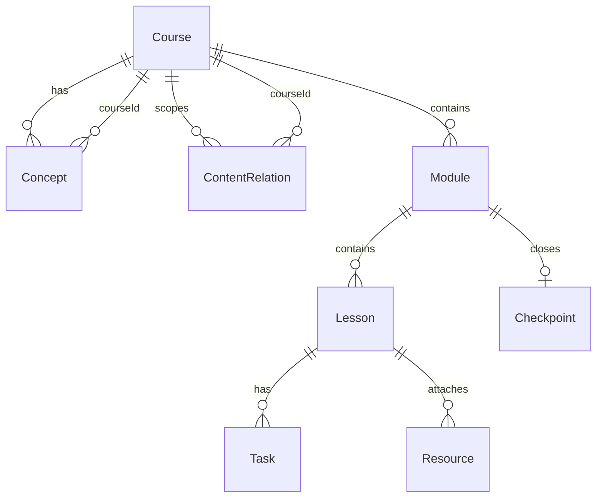

# Course Knowledge Graph

## Назначение документа

Описывает модуль **Course Knowledge Graph** — Obsidian-like визуализацию связей внутри курса и между учебными сущностями.

**Не** используем Obsidian, Obsidian Publish или их плагины как runtime dependency. Повторяем идею **Graph View** внутри LMS: узлы и рёбра хранятся в Postgres, UI — в Next.js.

Связанные документы:

- [DATABASE_MODEL.md](DATABASE_MODEL.md) — `Concept`, `ContentRelation`
- [COURSE_CONTENT_MODEL.md](COURSE_CONTENT_MODEL.md) — структура курса, markdown
- [AUTH_AND_ROLES.md](AUTH_AND_ROLES.md) — права learner vs author/admin
- [MVP_ROADMAP.md](MVP_ROADMAP.md) — фазы реализации

---

## Принципы

| Принцип | Решение |
|---------|---------|
| Obsidian как runtime | **Запрещено** — только UX-референс |
| Замена навигации курса | **Нет** — catalog, module list, lesson reader остаются primary |
| Source of truth | Postgres (`Concept`, `ContentRelation` + структурные сущности) |
| MVP renderer | [**React Flow**](https://reactflow.dev/) (`@xyflow/react`) |
| Large graph (future) | [**Sigma.js**](https://www.sigmajs.org/) — опциональная замена рендерера при >500 узлов |
| Learner | Read-only graph + фильтры + local subgraph |
| Author / Admin | CRUD связей и concepts (editor — после learner MVP) |

Граф — **дополнительная карта** для ориентации («что с чем связано»), не единственный способ проходить курс.

---

## Узлы (nodes)

Типы узлов в графе курса (`GraphNodeType`):

| Тип | Источник в БД | Назначение |
|-----|---------------|------------|
| `course` | `Course` | Корень курса (обычно один узел на экран) |
| `module` | `Module` | Блок / глава |
| `lesson` | `Lesson` | Урок (markdown) |
| `concept` | `Concept` | Абстрактная тема (глоссарий, «идея») |
| `task` | `Task` | Практическое задание |
| `project` | `Checkpoint` | Итоговый проект модуля |
| `resource` | `Resource` | Ссылка, файл, видео |

Узел в UI = `{ type, id, label, href?, meta? }`. Данные подтягиваются из соответствующей таблицы; `concept` — только из `Concept`.

---

## Рёбра (edges)

Типы связей (`ContentRelationType`):

| relationType | Смысл | Типичный пример |
|--------------|--------|-----------------|
| `contains` | Иерархия «внутри» | course → module, module → lesson |
| `prerequisite` | Нужно пройти/понять до | lesson A → lesson B |
| `related_to` | Смежная тема без жёсткого порядка | concept ↔ concept |
| `continues` | Прямое продолжение narrative | lesson → lesson |
| `applies` | Теория → практика | lesson → task |
| `unlocks` | Открывает доступ (логический, не progress) | task → lesson |
| `blocks` | Явный блокер | lesson → project |
| `references` | Ссылка из контента | lesson → resource, lesson → concept |

Поле `weight` (Float, default `1`) — для layout и будущей сортировки силы связи.

**Важно:** `unlocks` / `blocks` в графе **не** меняют `LessonProgress` и enrollment. Детерминированный прогресс остаётся в progress layer. Граф может *отображать* зависимости; автоматическое открытие уроков по графу — отдельное продуктовое решение (не MVP).

---

## Модель данных (кратко)

См. полный Prisma draft в [DATABASE_MODEL.md](DATABASE_MODEL.md).

### Concept

| Поле | Тип | Описание |
|------|-----|----------|
| id | cuid | PK |
| courseId | FK → Course | Курс-владелец |
| title | string | Заголовок |
| description | text? | Описание |
| slug | string | Уникален в рамках course |
| createdAt / updatedAt | DateTime | |

### ContentRelation

Полиморфная связь в рамках одного `courseId`:

| Поле | Тип | Описание |
|------|-----|----------|
| id | cuid | PK |
| courseId | FK → Course | Scope графа |
| sourceType | GraphNodeType | Тип источника |
| sourceId | string | id сущности |
| targetType | GraphNodeType | Тип цели |
| targetId | string | id сущности |
| relationType | ContentRelationType | Тип ребра |
| weight | Float | default 1 |
| createdAt | DateTime | |

Уникальность: `(courseId, sourceType, sourceId, targetType, targetId, relationType)`.

### Авто-связи (structural)

При publish / seed сервис `lib/graph/sync-structural.ts` (Phase 2b) создаёт `contains` рёбра:

- `course` → `module`
- `module` → `lesson`
- `lesson` → `task`
- `module` → `project` (checkpoint)
- `lesson` → `resource`

Ручные связи (`prerequisite`, `related_to`, …) — только через admin/author editor или import.

### Auto-generate (later)

Парсинг wikilinks / markdown links в `Lesson.bodyMarkdown` → предложения `references` / `related_to` (author подтверждает). Не в MVP.

---

## API

### Route Handlers (read)

| Method | Path | Кто | Описание |
|--------|------|-----|----------|
| GET | `/api/courses/[courseId]/graph` | learner+ | Полный граф курса (nodes + edges), query: `types`, `depth` |
| GET | `/api/courses/[courseId]/graph/local` | learner+ | Subgraph от узла: `nodeType`, `nodeId`, `depth=1\|2\|3` |

Ответ (пример):

```json
{
  "nodes": [{ "id": "...", "type": "lesson", "label": "...", "href": "/learn/..." }],
  "edges": [{ "id": "...", "source": "...", "target": "...", "relationType": "prerequisite" }]
}
```

### Server Actions (write, admin/author)

| Action | Кто | Описание |
|--------|-----|----------|
| `createContentRelation` | author (own), admin | Новое ребро |
| `deleteContentRelation` | author (own), admin | Удалить ребро |
| `upsertConcept` | author (own), admin | CRUD concept |
| `deleteConcept` | author (own), admin | Удалить concept + связанные рёбра |

---

## UI

### Learner — `/courses/[courseId]/graph`

- React Flow canvas, read-only (no drag-to-connect).
- Клик по узлу → navigate: lesson → `/learn/[courseId]/[lessonId]`, task → якорь на lesson, concept → panel/sheet, resource → URL.
- Toolbar:
  - фильтр по типу узла (checkbox group);
  - legend по `relationType` (цвет ребра);
  - кнопка «Сбросить вид» (fit view).
- Ссылка «Карта курса» в header course detail и lesson reader — **не** заменяет «Следующий урок».

### Learner — local graph

На странице урока `/learn/...` — компактный виджет «Локальный граф»:

- центр = текущий lesson (или task);
- depth selector: 1 / 2 / 3 hops;
- тот же read-only React Flow или упрощённый mini-canvas.

### Admin / Author — graph editor (post-MVP learner graph)

Маршрут (Phase 3+): `/admin/courses/[courseId]/graph`

- режим редактирования: выбрать два узла → тип связи → создать ребро;
- удаление ребра (context menu);
- панель CRUD `Concept`;
- preview structural `contains` (read-only, серым).

---

## Технический стек UI

### MVP: React Flow

- Пакет: `@xyflow/react` (+ `@xyflow/system` транзитивно).
- Причина: зрелый React-канвас, кастомные node types, controls, minimap, fitView.
- Ограничение: большие графы (>300–500 узлов) могут тормозить — для MVP курсов друзей достаточно.

### Future: Sigma.js

- Когда: курс с сотнями concepts + cross-links, или cross-course graph (out of scope MVP).
- Подход: тот же API `/api/.../graph`, смена компонента `GraphCanvas` через feature flag `GRAPH_RENDERER=sigma|reactflow`.

**Не добавлять** Obsidian API, obsidian-export, или embedded Obsidian iframe.

---

## Структура кода (target)

```text
app/
  (learner)/courses/[courseId]/graph/page.tsx
  (learner)/learn/[courseId]/[lessonId]/   # + LocalGraphWidget
  (admin)/admin/courses/[courseId]/graph/page.tsx   # Phase 3+
  api/courses/[courseId]/graph/route.ts
  api/courses/[courseId]/graph/local/route.ts
components/
  graph/
    course-graph-canvas.tsx      # React Flow wrapper
    graph-node.tsx               # node by type
    graph-edge-legend.tsx
    graph-filters.tsx
    local-graph-widget.tsx
features/
  graph/
    build-graph.ts               # DB → React Flow elements
    graph-permissions.ts
lib/
  graph/
    sync-structural.ts           # auto contains edges
    validate-relation.ts
```

Layout: `elkjs` или встроенный `dagre` (опционально Phase 2b+) для авто-layout; MVP — `layout: { type: 'dagre' }` или ручной `position` cache в JSON (later).

---

## Права доступа

| Действие | learner | author | admin |
|----------|:-------:|:------:|:-----:|
| Просмотр graph опубликованного курса | ✓ (enrolled или visibility) | ✓ | ✓ |
| Просмотр draft graph | — | own courses | ✓ |
| Создать/удалить relation | — | own | ✓ |
| CRUD concept | — | own | ✓ |

Проверки: `canViewCourse` + enrollment; mutations — `canEditCourse` ([AUTH_AND_ROLES.md](AUTH_AND_ROLES.md)).

---

## ER (фрагмент)



`ContentRelation` не имеет FK на `Lesson`/`Task`/… — целостность через application-level validation при create.

---

## Acceptance (архитектура)

- [x] Модуль описан; Obsidian не является зависимостью.
- [x] React Flow — MVP renderer; Sigma.js — future option.
- [x] `Concept` и `ContentRelation` в модели БД.
- [x] Learner graph read-only; editing — author/admin, позже MVP learner.
- [x] Граф не заменяет catalog / lesson reader / progress.

---

## Связь с import/export

Export включает `concepts[]` и `relations[]` в JSON pack (Phase 6+). Import делает upsert по slug/id. Structural `contains` пересобираются при import + `sync-structural`.
