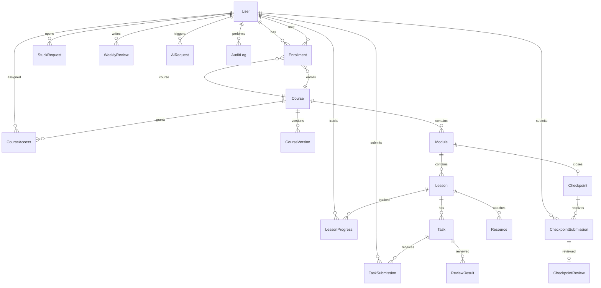

# Модель данных (PostgreSQL + Prisma)

## Назначение документа

Описывает целевую схему БД для Next.js full-stack версии `personal-lms`. Postgres — **source of truth** для структуры курсов, контента уроков и runtime state обучения.

Связанные документы: [NEXT_FULLSTACK_ADAPTATION.md](NEXT_FULLSTACK_ADAPTATION.md), [COURSE_CONTENT_MODEL.md](COURSE_CONTENT_MODEL.md), [AUTH_AND_ROLES.md](AUTH_AND_ROLES.md).

---

## Решение по Checkpoint

**Checkpoint — отдельная сущность** на уровне модуля (parity с previous runtime: `CheckpointSubmission`, `CheckpointReview`).

Не сводить checkpoint только к `Task` с типом `checkpoint`: модульный portfolio-project и review pipeline остаются явными.

---

## ER-диаграмма (логическая)



---

## Enums

### Role

```prisma
enum Role {
  admin
  author
  learner
}
```

### CourseStatus

```prisma
enum CourseStatus {
  draft
  published
  archived
}
```

### LessonStatus

```prisma
enum LessonStatus {
  draft
  published
  hidden
}
```

### CourseAccessMode

```prisma
enum CourseAccessMode {
  private
  platform_users
  assigned_users
}
```

### EnrollmentStatus

```prisma
enum EnrollmentStatus {
  active
  completed
  paused
  revoked
}
```

### ProgressStatus

```prisma
enum ProgressStatus {
  not_started
  in_progress
  completed
}
```

### TaskSubmissionStatus

```prisma
enum TaskSubmissionStatus {
  submitted
  under_review
  passed
  failed
  needs_revision
}
```

### StuckRequestStatus

```prisma
enum StuckRequestStatus {
  open
  resolved
}
```

### AIRequestKind

```prisma
enum AIRequestKind {
  explain_lesson
  hint
  stuck_help
  weekly_recap
  author_draft
  review_assist
}
```

### UploadKind

```prisma
enum UploadKind {
  lesson_resource
  submission_attachment
  course_asset
}
```

---

## Prisma schema draft

```prisma
generator client {
  provider = "prisma-client-js"
}

datasource db {
  provider = "postgresql"
  url      = env("DATABASE_URL")
}

model User {
  id            String   @id @default(cuid())
  email         String   @unique
  name          String
  role          Role     @default(learner)
  isActive      Boolean  @default(true)
  emailVerified Boolean  @default(false)
  createdAt     DateTime @default(now())
  updatedAt     DateTime @updatedAt

  enrollments            Enrollment[]
  lessonProgress         LessonProgress[]
  taskSubmissions        TaskSubmission[]
  checkpointSubmissions  CheckpointSubmission[]
  stuckRequests          StuckRequest[]
  weeklyReviews          WeeklyReview[]
  aiRequests             AIRequest[]
  courseAccess           CourseAccess[]
  auditLogs              AuditLog[]
  coursesAuthored        Course[]         @relation("CourseAuthor")

  @@index([role])
}

model Course {
  id          String           @id @default(cuid())
  slug        String           @unique
  title       String
  description String           @db.Text
  status      CourseStatus     @default(draft)
  accessMode  CourseAccessMode @default(private)
  version     Int              @default(1)
  publishedAt DateTime?
  authorId    String?
  author      User?            @relation("CourseAuthor", fields: [authorId], references: [id])
  createdAt   DateTime         @default(now())
  updatedAt   DateTime         @updatedAt

  modules      Module[]
  versions     CourseVersion[]
  enrollments  Enrollment[]
  courseAccess CourseAccess[]

  @@index([status])
  @@index([accessMode])
}

model CourseVersion {
  id          String   @id @default(cuid())
  courseId    String
  course      Course   @relation(fields: [courseId], references: [id], onDelete: Cascade)
  version     Int
  snapshot    Json
  publishedAt DateTime @default(now())
  publishedBy String?

  @@unique([courseId, version])
}

model Module {
  id          String  @id @default(cuid())
  courseId    String
  course      Course  @relation(fields: [courseId], references: [id], onDelete: Cascade)
  slug        String
  title       String
  description String  @db.Text
  sortOrder   Int     @default(0)
  block       Int?

  lessons    Lesson[]
  checkpoint Checkpoint?

  @@unique([courseId, slug])
  @@index([courseId, sortOrder])
}

model Lesson {
  id            String       @id @default(cuid())
  moduleId      String
  module        Module       @relation(fields: [moduleId], references: [id], onDelete: Cascade)
  slug          String
  title         String
  summary       String       @db.Text
  bodyMarkdown  String       @db.Text
  objectives    Json
  sourceIds     String[]
  status        LessonStatus @default(draft)
  sortOrder     Int          @default(0)
  createdAt     DateTime     @default(now())
  updatedAt     DateTime     @updatedAt

  tasks          Task[]
  resources      Resource[]
  lessonProgress LessonProgress[]

  @@unique([moduleId, slug])
  @@index([moduleId, sortOrder])
}

model Task {
  id               String  @id @default(cuid())
  lessonId         String
  lesson           Lesson  @relation(fields: [lessonId], references: [id], onDelete: Cascade)
  slug             String
  title            String
  summary          String  @db.Text
  instructions     String  @db.Text
  submissionType   String
  definitionOfDone String  @db.Text
  reviewMode       String  @default("manual")
  hints            Json?
  sortOrder        Int     @default(0)

  submissions TaskSubmission[]

  @@unique([lessonId, slug])
}

model Resource {
  id        String     @id @default(cuid())
  lessonId  String?
  lesson    Lesson?    @relation(fields: [lessonId], references: [id], onDelete: Cascade)
  uploadId  String?
  upload    Upload?    @relation(fields: [uploadId], references: [id])
  title     String
  url       String?
  kind      String
  sortOrder Int        @default(0)
}

model Checkpoint {
  id               String @id @default(cuid())
  moduleId         String @unique
  module           Module @relation(fields: [moduleId], references: [id], onDelete: Cascade)
  slug             String
  title            String
  summary          String @db.Text
  description      String @db.Text
  definitionOfDone String @db.Text
  submissionType   String

  submissions CheckpointSubmission[]
}

model Enrollment {
  id              String           @id @default(cuid())
  userId          String
  user            User             @relation(fields: [userId], references: [id], onDelete: Cascade)
  courseId        String
  course          Course           @relation(fields: [courseId], references: [id], onDelete: Cascade)
  status          EnrollmentStatus @default(active)
  progressPct     Int              @default(0)
  currentModuleId String?
  currentLessonId String?
  startedAt       DateTime         @default(now())
  updatedAt       DateTime         @updatedAt
  completedAt     DateTime?

  @@unique([userId, courseId])
  @@index([userId, status])
}

model CourseAccess {
  id       String @id @default(cuid())
  courseId String
  course   Course @relation(fields: [courseId], references: [id], onDelete: Cascade)
  userId   String
  user     User   @relation(fields: [userId], references: [id], onDelete: Cascade)

  @@unique([courseId, userId])
}

model LessonProgress {
  id           String         @id @default(cuid())
  userId       String
  user         User           @relation(fields: [userId], references: [id], onDelete: Cascade)
  lessonId     String
  lesson       Lesson         @relation(fields: [lessonId], references: [id], onDelete: Cascade)
  status       ProgressStatus @default(not_started)
  openedCount  Int            @default(0)
  startedAt    DateTime?
  lastOpenedAt DateTime?
  completedAt  DateTime?

  @@unique([userId, lessonId])
  @@index([userId, status])
}

model TaskSubmission {
  id              String               @id @default(cuid())
  userId          String
  user            User                 @relation(fields: [userId], references: [id], onDelete: Cascade)
  taskId          String
  task            Task                 @relation(fields: [taskId], references: [id], onDelete: Cascade)
  contentText     String?              @db.Text
  contentLink     String?
  uploadId        String?
  status          TaskSubmissionStatus @default(submitted)
  createdAt       DateTime             @default(now())
  updatedAt       DateTime             @updatedAt

  review ReviewResult?

  @@index([userId, taskId])
}

model ReviewResult {
  id              String         @id @default(cuid())
  submissionId    String         @unique
  submission      TaskSubmission @relation(fields: [submissionId], references: [id], onDelete: Cascade)
  verdict         String
  feedback        String         @db.Text
  blockingReason  String?
  reviewedById    String?
  createdAt       DateTime       @default(now())
}

model CheckpointSubmission {
  id           String   @id @default(cuid())
  userId       String
  user         User     @relation(fields: [userId], references: [id], onDelete: Cascade)
  checkpointId String
  checkpoint   Checkpoint @relation(fields: [checkpointId], references: [id], onDelete: Cascade)
  contentText  String?  @db.Text
  contentLink  String?
  status       TaskSubmissionStatus @default(submitted)
  createdAt    DateTime @default(now())
  updatedAt    DateTime @updatedAt

  review CheckpointReview?

  @@index([userId, checkpointId])
}

model CheckpointReview {
  id           String               @id @default(cuid())
  submissionId String               @unique
  submission   CheckpointSubmission @relation(fields: [submissionId], references: [id], onDelete: Cascade)
  verdict      String
  feedback     String               @db.Text
  reviewedById String?
  createdAt    DateTime             @default(now())
}

model StuckRequest {
  id         String             @id @default(cuid())
  userId     String
  user       User               @relation(fields: [userId], references: [id], onDelete: Cascade)
  courseId   String
  lessonId   String
  taskId     String?
  reasonCode String
  note       String?            @db.Text
  status     StuckRequestStatus @default(open)
  createdAt  DateTime           @default(now())
  resolvedAt DateTime?

  @@index([userId, status])
}

model WeeklyReview {
  id                String   @id @default(cuid())
  userId            String
  user              User     @relation(fields: [userId], references: [id], onDelete: Cascade)
  weekStart         DateTime
  completedLessons  Json
  completedTasks    Json
  notes             String?  @db.Text
  blockers          String?  @db.Text
  nextFocus         String?  @db.Text
  aiRecapText       String?  @db.Text
  createdAt         DateTime @default(now())

  @@unique([userId, weekStart])
}

model AIRequest {
  id          String        @id @default(cuid())
  userId      String
  user        User          @relation(fields: [userId], references: [id], onDelete: Cascade)
  kind        AIRequestKind
  contextKey  String
  promptHash  String?
  inputMeta   Json?
  outputMeta  Json?
  tokensIn    Int?
  tokensOut   Int?
  durationMs  Int?
  createdAt   DateTime      @default(now())

  @@index([userId, createdAt])
  @@index([kind])
}

model Upload {
  id           String     @id @default(cuid())
  storageKey   String     @unique
  filename     String
  mimeType     String
  sizeBytes    Int
  kind         UploadKind
  uploadedById String
  createdAt    DateTime   @default(now())

  resources Resource[]
}

model AuditLog {
  id         String   @id @default(cuid())
  actorId    String
  actor      User     @relation(fields: [actorId], references: [id])
  action     String
  entityType String
  entityId   String
  meta       Json?
  createdAt  DateTime @default(now())

  @@index([actorId, createdAt])
  @@index([entityType, entityId])
}
```

Better-Auth создаёт дополнительные таблицы (`session`, `account`, …) — не дублировать вручную; интеграция через adapter Prisma.

---

## CourseVersion (MVP vs later)

**MVP (Phase 2–3):** поля `Course.version` (Int) + `Course.publishedAt` при publish.

**Phase 3+:** полная модель `CourseVersion` с JSON snapshot для rollback и diff. Таблица в схеме заложена; наполнение snapshot — при первом publish после Phase 3.

---

## Индексы и уникальность (обязательные)

| Ограничение | Назначение |
|-------------|------------|
| `@@unique([userId, courseId])` на Enrollment | один enrollment на курс |
| `@@unique([userId, lessonId])` на LessonProgress | один progress на урок |
| `@@unique([courseId, slug])` на Module | slug уникален в курсе |
| `@@unique([moduleId, slug])` на Lesson | slug уникален в модуле |
| `Course.slug` @unique | URL-stable идентификатор |
| `User.email` @unique | login |

---

## Миграции

- Только **Prisma Migrate** (`prisma migrate dev` / `migrate deploy`).
- `prisma db push` — только локальный прототип, не production.
- Seed: `prisma/seed.ts` — admin user, опционально demo course.

---

## Агрегация progress

`Enrollment.progressPct` вычисляется сервером из `LessonProgress` (published lessons only):

```
progressPct = round(completedPublishedLessons / totalPublishedLessons * 100)
```

Не хранить дублирующие «истины» в AI или клиенте.

---

## Связь с import/export

Export сериализует дерево `Course → Module → Lesson → Task → Checkpoint` в JSON/ZIP. Import делает upsert по `slug` в рамках курса. Детали: [COURSE_CONTENT_MODEL.md](COURSE_CONTENT_MODEL.md).
