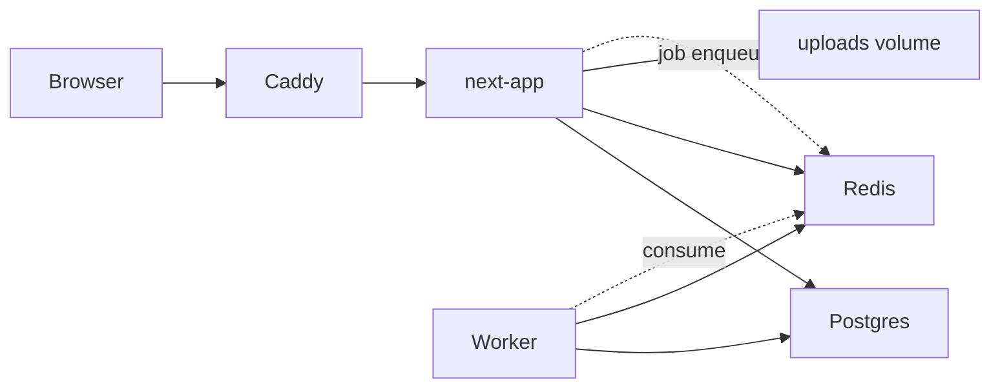

# Модель деплоя

## Назначение документа

Описывает self-hosted deployment как primary path и optional cloud path. Не привязывает проект к Vercel.

Связанные документы: [MVP_ROADMAP.md](MVP_ROADMAP.md), [NEXT_FULLSTACK_ADAPTATION.md](NEXT_FULLSTACK_ADAPTATION.md).

Previous deployment notes: [docs/deployment/VPS_DEPLOYMENT.md](../deployment/VPS_DEPLOYMENT.md), [BACKUP_AND_RECOVERY.md](../deployment/BACKUP_AND_RECOVERY.md).

---

## Primary: Docker Compose (VPS / VM / Proxmox)

```text
infra/docker-compose.yml
```

### Services

| Service | Image / build | Назначение |
|---------|---------------|------------|
| `next-app` | Dockerfile (Next standalone) | Web UI + API |
| `postgres` | `postgres:16-alpine` | Primary DB |
| `redis` | `redis:7-alpine` | Sessions, rate limits, job queue |
| `caddy` | `caddy:2-alpine` | TLS reverse proxy |
| `worker` | Dockerfile.worker | Code runner, async jobs (Phase 2+) |
| `uploads` | volume mount | Local files MVP |

### Topology



### Ports (internal)

- `next-app`: 3000 (только docker network)
- `postgres`: 5432 (не публиковать наружу)
- `redis`: 6379 (не публиковать наружу)
- `caddy`: 80, 443 (public)

### Next.js build

`output: "standalone"` в `next.config.ts` для минимального runtime image.

---

## Redis — зачем

Previous stack Redis не использовал. В target:

| Use case | Phase |
|----------|-------|
| Session store (optional, если не DB sessions) | 1 |
| Rate limiting (Arcjet complement) | 1 |
| Background job queue (import, export) | 6 |
| Worker job dispatch | 2+ |

MVP может начать с DB-backed sessions (Better-Auth + Postgres) и добавить Redis в Compose с Phase 1 для rate limits.

---

## File storage

### MVP (local volume)

```text
volumes:
  uploads:
    driver: local
```

`UPLOAD_STORAGE=local`
`UPLOAD_DIR=/data/uploads`

### Production (S3-compatible)

`UPLOAD_STORAGE=s3`
`S3_ENDPOINT`, `S3_BUCKET`, `S3_ACCESS_KEY`, `S3_SECRET_KEY`

Upload flow: Route Handler validates → writes metadata → presigned URL для download.

---

## Env validation

`lib/validation/env.ts` (Zod):

- fail fast при старте если required vars missing;
- разные схемы для `development` | `production`.

Обязательные production vars:

```text
NODE_ENV=production
DATABASE_URL=
BETTER_AUTH_SECRET=
BETTER_AUTH_URL=
REDIS_URL=
AI_MODE=
UPLOAD_STORAGE=
```

---

## Caddyfile (пример)

```caddyfile
lms.example.com {
  reverse_proxy next-app:3000
  encode gzip
}
```

TLS: automatic Let's Encrypt или internal CA.

---

## Migrations

При deploy:

```bash
npx prisma migrate deploy
```

В Compose — one-shot service `migrate` или entrypoint script перед `next-app` start.

---

## Backup strategy

| Asset | Метод | Частота |
|-------|-------|---------|
| Postgres | `pg_dump` → encrypted storage | daily |
| Uploads volume | `tar` / rsync | daily |
| Env secrets | out-of-band (password manager) | on change |

Script: `infra/scripts/backup.sh`

Restore drill: см. [BACKUP_AND_RECOVERY.md](../deployment/BACKUP_AND_RECOVERY.md) — адаптировать под Postgres.

---

## Runner tiers

### MVP-safe (Phase 2 default)

- Tasks: `text`, `link`, `quiz`, `command_output` (user-typed, не executed);
- Manual / deterministic review;
- **Нет** subprocess в next-app.

### Trusted (не для friends production)

- Subprocess runner только если `user.role === admin`;
- отдельный env flag `RUNNER_TRUSTED_ENABLED=true`;
- только closed deployment.

### Production runner (Phase 2+)

Отдельный сервис `worker/`:

| Property | Value |
|----------|-------|
| Isolation | Docker container per run |
| Network | disabled |
| User | non-root |
| CPU / memory | cgroup limits |
| Timeout | 30s default |
| Queue | Redis BullMQ |

Next-app **никогда** не вызывает `exec` для learner code.

API: `POST /api/runner/run` (admin/trusted only, Phase 2+).

---

## Optional cloud path

Не primary. Допустимо для экспериментов:

| Component | Service |
|-----------|---------|
| Frontend | Vercel |
| DB | Neon Postgres |
| Storage | Cloudflare R2 / AWS S3 |
| Redis | Upstash |

Ограничения:

- worker sandbox на Vercel **не** подходит — runner остаётся на VPS;
- env parity через те же Zod schemas.

---

## CI/CD (рекомендация)

| Step | Action |
|------|--------|
| PR | lint, typecheck, prisma validate, unit tests |
| main | build docker image, push registry |
| deploy | SSH / compose pull на VPS |

Не требовать Vercel для CI green.

---

## Health checks

- `GET /api/health` → `{ status: "ok", db: true, redis: true }`
- Docker `HEALTHCHECK` на next-app
- Postgres: `pg_isready`

---

## Security baseline (deploy)

- TLS только через Caddy;
- Postgres/Redis не exposed publicly;
- secrets через `.env` (не в git);
- `next-app` runs non-root;
- upload size limits at reverse proxy (optional);
- security headers via Next.js middleware.

Arcjet — optional edge layer, не замена network isolation.

---

## Phase 7 deliverables

- [ ] `infra/docker-compose.yml` + `docker-compose.dev.yml`
- [ ] `infra/Caddyfile`
- [ ] `infra/scripts/backup.sh`
- [ ] `infra/scripts/deploy.sh`
- [ ] Production env template `.env.production.example`
- [ ] Документ `docs/deployment/NEXT_SELF_HOSTED.md` (implementation task, не Phase 0)
