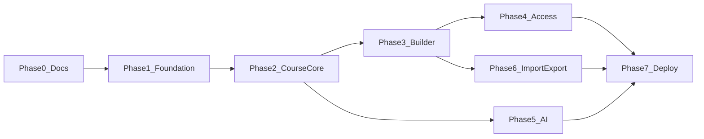

# MVP Roadmap (Next.js full-stack)

## Назначение документа

Пошаговый план реализации target-архитектуры. Phase 0 — только документация (этот набор файлов). Phase 1–7 — implementation.

Master doc: [NEXT_FULLSTACK_ADAPTATION.md](NEXT_FULLSTACK_ADAPTATION.md).

---

## Обзор фаз

| Phase | Название | Статус |
|-------|----------|--------|
| 0 | Architecture | **текущая** — docs only |
| 1 | Foundation | Next, Prisma, Auth, layouts |
| 2 | Course Core | catalog, reader, enrollment, progress |
| 3 | Admin Course Builder | CRUD, markdown, publish |
| 4 | Access Control | users, access modes, audit |
| 5 | AI Layer | external + log (+ api optional) |
| 6 | Import / Export | JSON/ZIP |
| 7 | Deploy | Compose, Caddy, backup |

---

## Phase 0 — Architecture

**Deliverables:**

- [x] [NEXT_FULLSTACK_ADAPTATION.md](NEXT_FULLSTACK_ADAPTATION.md)
- [x] [DATABASE_MODEL.md](DATABASE_MODEL.md)
- [x] [AUTH_AND_ROLES.md](AUTH_AND_ROLES.md)
- [x] [COURSE_CONTENT_MODEL.md](COURSE_CONTENT_MODEL.md)
- [x] [AI_LAYER.md](AI_LAYER.md)
- [x] [DEPLOYMENT_MODEL.md](DEPLOYMENT_MODEL.md)
- [x] [MVP_ROADMAP.md](MVP_ROADMAP.md)
- [x] Баннеры previous architecture

**Acceptance:**

- Документы на русском, enums согласованы;
- Stripe/marketplace не in-scope;
- Cutover `app/` описан.

---

## Phase 1 — Foundation

**Предусловие:** product decision — обновить AGENTS.md / guardrails.

**Задачи:**

1. Git tag `pre-next-cutover`.
2. Перенос Python `app/` → `legacy/fastapi-app/`.
3. `create-next-app` в `app/` (App Router, TypeScript, Tailwind).
4. shadcn/ui init.
5. Prisma + Postgres (docker compose dev).
6. Better-Auth + seeded admin.
7. Layout groups: `(auth)`, `(learner)`, `(admin)`.
8. Protected routes middleware.
9. `lib/validation/env.ts`.

**Acceptance:**

- `docker compose up` поднимает postgres + next-app;
- login/logout работает;
- admin seed доступен;
- learner redirect на login без сессии.

---

## Phase 2 — Course Core

**Задачи:**

1. Prisma models: Course, Module, Lesson, Task, Enrollment, LessonProgress.
2. `/courses` catalog (published + visibility).
3. `/courses/[courseId]` course detail + enroll button.
4. `/learn/[courseId]/[lessonId]` markdown reader.
5. Server Action: mark lesson complete.
6. Progress bar на course / dashboard.
7. `/dashboard` continue learning.

**Acceptance:**

- Admin seed создаёт demo course в seed;
- Learner enroll → read lesson → mark complete → progress обновился;
- AI не требуется.

**Runner:** только MVP-safe task types.

---

## Phase 3 — Admin Course Builder

**Задачи:**

1. `/admin/courses` list + create.
2. Course edit, module CRUD, lesson CRUD.
3. Markdown editor + preview.
4. Publish/unpublish course и lesson.
5. Checkpoint editor на module.

**Acceptance:**

- Author создаёт курс с нуля через UI;
- Publish делает курс видимым в catalog (по accessMode).

---

## Phase 4 — Access Control

**Задачи:**

1. `/admin/users` CRUD (admin only).
2. Role assignment.
3. `CourseAccess` для `assigned_users`.
4. Catalog filters по accessMode.
5. `AuditLog` на admin mutations.

**Acceptance:**

- Новый user только через admin;
- Assigned course виден только назначенным;
- Audit запись при assign access.

---

## Phase 5 — AI Layer

**Задачи:**

1. `AI_MODE=external` prompt builder.
2. UI panel на lesson page.
3. `AIRequest` logging.
4. Stuck flow → `stuck_help` prompt.
5. Weekly review → recap prompt.
6. (Optional) `AI_MODE=api` OpenAI integration.

**Acceptance:**

- Explain/hint/stuck возвращают prompt (external);
- Нет mutation progress через AI routes;
- Requests в БД.

---

## Phase 6 — Import / Export

**Задачи:**

1. `content-import/schemas/course-pack.v1.json`.
2. Export JSON + ZIP.
3. Import с validation report.
4. Admin UI `/admin/import`.

**Acceptance:**

- Export → import roundtrip восстанавливает курс;
- Invalid pack → errors без partial corrupt state.

---

## Phase 7 — Deploy

**Задачи:**

1. `infra/docker-compose.yml` production profile.
2. Caddy TLS.
3. `prisma migrate deploy` в deploy script.
4. `infra/scripts/backup.sh`.
5. `.env.production.example`.
6. Production smoke checklist.

**Acceptance:**

- Чистый VPS: clone → env → compose up → HTTPS → login;
- Backup script создаёт dump.

---

## MVP v1 scope (рекомендация)

### Включить

- Auth (admin-seeded users), роли admin/author/learner
- Course catalog, enrollment, lesson reader, mark complete
- Admin CRUD + markdown preview + publish
- Access modes: private, platform_users, assigned_users
- AI external mode (explain, hint, stuck, weekly recap)
- Weekly review form
- Export/import JSON (ZIP — Phase 6 если tight)

### Отложить

- Stripe, marketplace, certificates
- Public self-signup
- Browser IDE
- Live collaboration
- Kubernetes
- Video DRM
- Rich-text WYSIWYG editor
- Code runner sandbox (кроме MVP-safe tasks)
- Full `CourseVersion` snapshot history

---

## Зависимости от previous repo

| Asset | Использование |
|-------|---------------|
| `content/` | archive only (fresh start) |
| `content/blueprints/` | curriculum reference |
| `docs/product/*` | product vision unchanged |
| `legacy/fastapi-app/` | reference implementation |

---

## Риски по фазам

| Phase | Риск | Митигация |
|-------|------|-----------|
| 1 | Конфликт `app/` | tag + legacy move |
| 1 | Guardrails vs Next | explicit AGENTS update |
| 2 | Scope creep в reader | markdown only MVP |
| 3 | Editor complexity | textarea + preview, не WYSIWYG |
| 5 | AI scope | external first |
| 7 | Ops burden | compose + backup script |

---

## Next step после Phase 0

1. Approve architecture docs.
2. Task: update AGENTS.md + PROJECT_GUARDRAILS.
3. Start Phase 1: legacy move + Next scaffold.
